# PS人像修图指南

---

​		这里要首先讲一下，就是不管教程的好坏，你如果看了不实践是没有意义的，对于一些不太理解的地方可以多尝试一下，这样你才能了解他到底是有什么样的功能，就像玩游戏一样，你得先知道这个技能是干什么的，才能在实际应用中更好的掌握它。下面我会从几个方面详细讲解：调色、磨皮、添加装饰、添加灯光照明。

[toc]

## 调色

因为前期你可以用其他软件进行基本简单的处理，所以照片导入到PS中后就优先调整它的色调。

### 1.1	白平衡

第一个，先用下图的吸管吸取照片中没有颜色的部分（就是黑、白、灰），让照片的色彩还原为真实色彩。

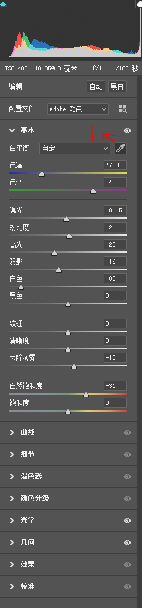

### 1.2	曝光及明暗调整

曝光：先看照片整体是偏暗还是偏亮，在进行曝光调整。
对比度：如果照片的明暗对比不强（意思就是照片看着像有一层薄膜）就需要调一下。
高光和阴影：调整的是照片明暗部分，高光下面的拖动条意思就是你调整照片高光的明暗，下面的阴影同理。
白色和黑色：和高光差不多，调整的是照片的白色部分和黑色部分。

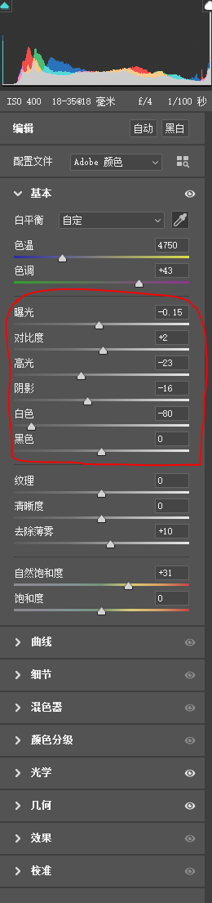

### 1.3	纹理和饱和度

这部分我准备在后面讲，这里就不多说了。纹理、清晰度和去除薄雾就是让照片清晰，因为现在照相机配置都很好，所以这个功能会很少用到。

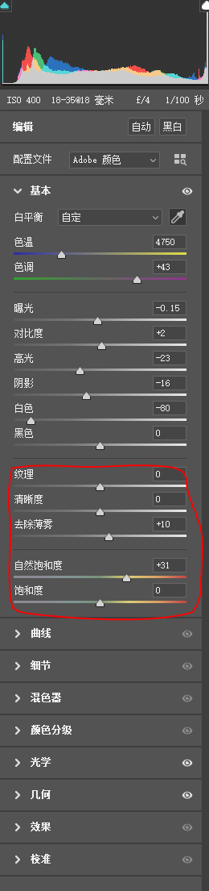

### 1.4	混色器

这里要讲讲混色器，这个还是比较重要，下面的调整旁边有个下拉条，一般我们调整HSL。
在下面有三个东西`色相、饱和度、明亮度`。

- 色相
  调整的是照片的颜色偏向，意思就是调整下面的某一种颜色偏向它下面的一种颜色或上面一种颜色，这个是循环的。
- 饱和度
  调整的就是照片中某一种颜色的鲜艳程度，如果希望某种颜色尽量不要太鲜艳，就可以把它网左拉。
- 明亮度
  调整的就是照面中某一种颜色的明暗。

上面这三个也可以整体调整，后面我会讲到。

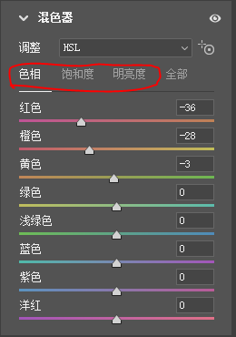

### 1.5	色相饱和度和色彩平衡

**色相饱和度菜单（Ctrl+U）**

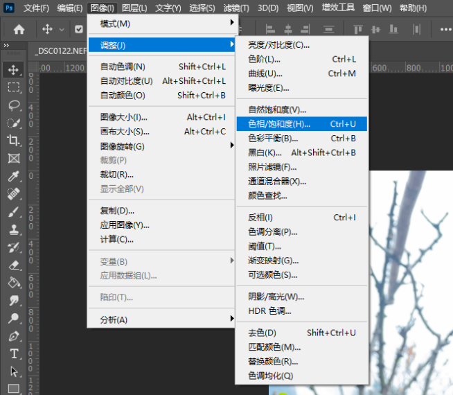

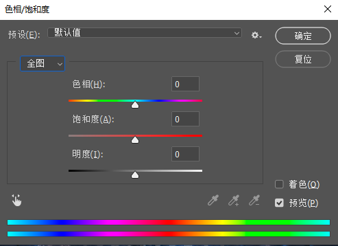

这个和上面的混色器有点类似，不过这个调整的是照片的整体，混色器调整的单个颜色。

**色彩平衡菜单（Ctrl+B）**

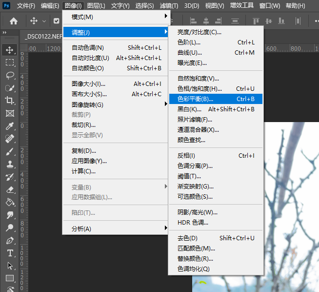

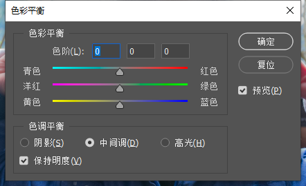

​		这个要着重讲一讲,你看他下面的色调平衡有三个选项，就是**阴影、中间调、高光**。这三个选择就是你想调整照片的那一部分。选好你要调整的那一部分后，就调整上面的色彩平衡，青色和蓝色加强就是你选择的部分呈现冷色，红色和黄色加强就是你选择的部分呈现暖色。调色部分基本就是这么多了。

## 磨皮

### 2.1	磨皮处理

实现原理步骤：

- 复制图层（ctrl+j）**命名：美白层** ----在实际操作中尽量别碰到原始图层
- 混色器（<u>菜单里面的滤镜可以再到Camera Row</u>）里面调整**橙色**（皮肤色）的饱和度（降低）和明亮度（提高）
- 在复制一层**美白层（命名：模糊层）**图层在混色器里面降低**纹理和清晰度**，然后把**美白层**放在这层的上面
- 把最上层（美白层）的图层去色（顶部菜单栏---图像---调整---去色）shift+ctrl+U
- 保留照片的高反差（顶部菜单栏---滤镜---其他---高反差保留）里面有个拖动条，把它拿到稍微能看清眼睛、嘴巴、鼻子等五官就差不多了
- 把图层（美白层）模式改为亮光
  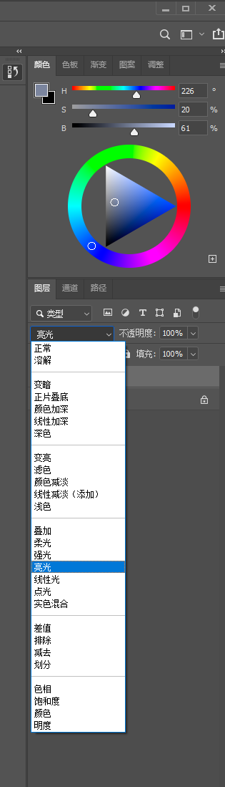
- 再复制一层背景图层，把它放到美白层和模糊成的中间，命名：调整层，用橡皮工具（就是左边的工具栏里面）擦除有痘印或者是想调整的地方（基本就是皮肤部分），**注意：别擦到五官**。
- 这里就是添加灵魂的一步了。
  1. 选择模糊层
  2. 选择画笔工具里面的**混合器画笔工具**
     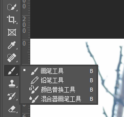
  3. 在点一下这个工具，再把右边的透明度和流量调整到40%---60%之间（这个数值因人而异）。
     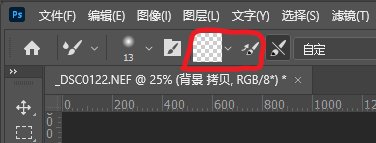
  4. 保证这时候选中的是模糊层，然后开始在有痘印或者是想擦除污点的地方涂抹（注意阴影部分）。

这里值得注意的是任何磨皮都是先模糊后清晰的这个逻辑顺序。

## 添加装饰

### 3.1	找素材

这里就是你在网上寻找你需要添加到照片里面的一些装饰元素。有几个我常用的网站你可以去看看。

- [免扣素材网站](https://www.mksucai.com/)----免费
- [另一个免扣素材网站](https://www.miankousucai.com/)----免费
- [昵图网](https://www.nipic.com/)和[我图网](https://www.ooopic.com/)----收费
- [百度图库](https://image.baidu.com/)----免费

### 3.2	处理

素材下载完成后，就把它直接拖到PS里面的照片上面。

这里有几个步骤：

- 先调整素材的位置和大小，位置就是可以直接拖动，
  然后放大缩小素材（顶部菜单栏---编辑---自由变换）快捷键：ctrl+T
- 然后再给素材图层建立图层蒙版，选中素材图层，然后点击图层蒙版（在软件的右下角）
  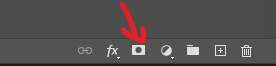
- 确保选中的是蒙版，然后用画笔工具，前景色设置为黑色，抹去你不想要的地方就可以了。
  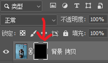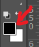

## 添加光效

### 4.1	增加灯光的效果

这里要讲一点，我会建立三个图层来调整，第一层调整光的核心点，第二层调整光的中间扩大部分，第三层调整散发区域

- 在照片或素材上面建立一层新图层（用黑色背景填充），选中新图层按X----在按ctrl+delete`（这个键在方向键的上面）`
- 把这个图层的模式改为颜色减淡
  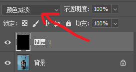
- 选中画笔（前景色为白色），调整画笔的不透明度（60%）和流量（5%），然后涂抹你想要有光效的地方
  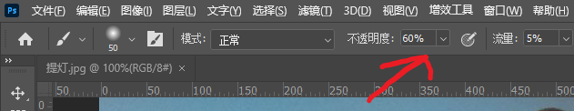
- 再新建一个图层，模式改为叠加，画笔放大点画周围的部分
- 再新建一个图层，模式也改为叠加，画笔再放大点画发散出去的部分

看看最后结果
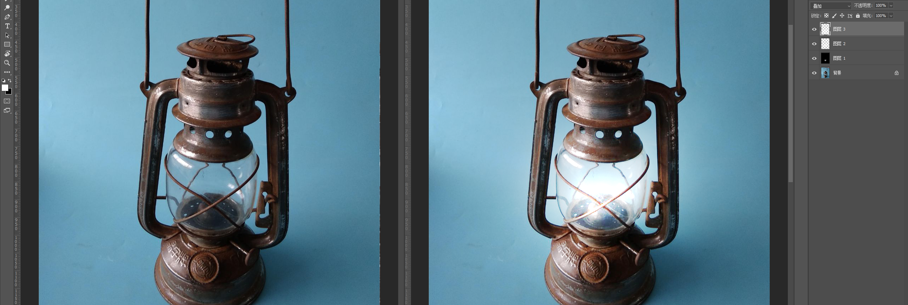

好了，到这里，你需要的基本技能都应该有了，不会的我你遇到新的问题的时候在问。

## 总结

​		修图的意义在于让照片更加好看，更加符合大众的审美标准，因为每个人的审美标准不一样，所以只能符合大多数，也就是符合主流的审美标准。这本指南的目的也在于此，不会有过度精细的方式去处理照片，因为这主要是为我朋友旅拍修图写的。跟精细的处理方式比较适合高级商业人像，比如肖像、海报等等。

---

所谓审美，就是既能以整体性的眼光看事物，同时又能觉察到它的深度。大自然之美就在于它的整体性，而艺术与音乐之美则在于它的深度。
                                                                                                                                                                                                                          --------郑泉

[返回顶部](#PS人像修图指南)
